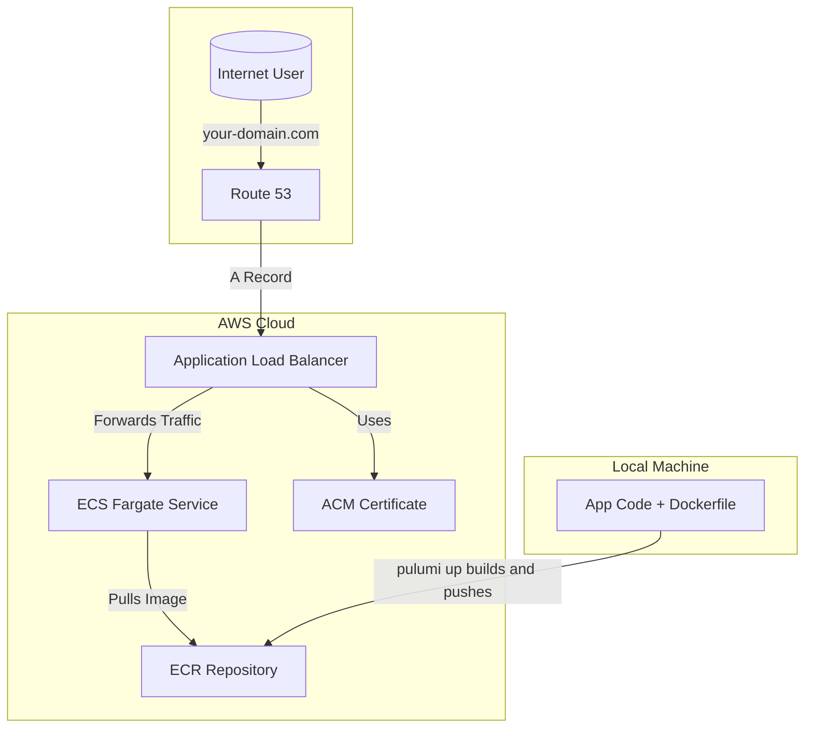

# Pulumi AWS Fargate Template (TypeScript)

This repository is a Pulumi template for creating a containerized service on AWS Fargate. The infrastructure is defined in `index.ts` using TypeScript.

## Architecture Diagram



## Architecture

This template provisions the following AWS resources:

-   **AWS Fargate Service on an ECS Cluster**: The application runs as a containerized service using AWS Fargate, which removes the need to manage servers.
-   **Application Load Balancer (ALB)**: An ALB is set up to distribute incoming traffic to the Fargate service. It handles HTTP to HTTPS redirection.
-   **ECR (Elastic Container Registry)**: A private ECR repository stores the Docker image for the application.
-   **Route 53**: A Route 53 A record is created to point your custom domain to the ALB.

## `index.ts` Structure

The `index.ts` file defines the cloud infrastructure. Here's a breakdown of its components:

1.  **Configuration**: It uses `pulumi.Config` to load required configuration values for your environment, such as your domain name and AWS resource ARNs.
2.  **ECS Cluster**: A new ECS cluster (`aws.ecs.Cluster`) is created to host the containerized services.
3.  **Networking**: An Application Load Balancer (`awsx.lb.ApplicationLoadBalancer`) is provisioned to route external traffic to the service. It listens on port 80 (for HTTP to HTTPS redirection) and 443.
4.  **Route 53 Record**: A Route 53 'A' record is set up to associate your custom domain with the ALB.
5.  **Container Registry**: An ECR repository (`awsx.ecr.Repository`) is created to store the application's Docker image.
6.  **Image Build & Push**: The script defines an `awsx.ecr.Image` resource which tells Pulumi to:
    -   Build a Docker image from a local source directory (you must specify the path).
    -   Target the `linux/arm64` architecture, suitable for AWS Graviton processors.
    -   Push the built image to the ECR repository.
7.  **Fargate Service**: The core `awsx.ecs.FargateService` resource ties everything together.
8.  **Outputs**: The program exports the final URL of the service.

## Prerequisites

-   Pulumi CLI (>= v3): https://www.pulumi.com/docs/get-started/install/
-   Node.js (>= 18) and pnpm: https://nodejs.org/ & https://pnpm.io/
-   AWS credentials configured (e.g., via `aws configure` or environment variables).
-   Docker installed and running.
-   A registered domain name with a hosted zone in Route 53.
-   An ACM certificate for your domain validated in the same region.

## Initial AWS Setup

Before using this template, you need to configure a few resources in your AWS account.

### 1. Route 53 Hosted Zone

You need a public hosted zone in Amazon Route 53 for the domain you intend to use.

-   If you already have a domain registered with Route 53, a hosted zone is configured for you automatically.
-   If your domain is registered with another provider, you can create a hosted zone and then update the name server (NS) records at your domain registrar to point to the AWS name servers.
-   You can find the ID for your hosted zone in the Route 53 console. It will look something like `Z0123456789ABCDEFGHIJ`.

### 2. ACM Certificate

You need an SSL/TLS certificate from AWS Certificate Manager (ACM) to enable HTTPS on the Application Load Balancer.

-   Navigate to the **AWS Certificate Manager** console. **Make sure you are in the same AWS region where you plan to deploy your infrastructure.**
-   Request a new **public certificate**.
-   Enter your domain name (e.g., `your-domain.com`) and a wildcard for subdomains (e.g., `*.your-domain.com`).
-   Choose **DNS validation**. AWS will provide you with CNAME records that you must add to your Route 53 hosted zone to prove you own the domain.
-   Once the certificate's status is **Issued**, copy its ARN. It will look like `arn:aws:acm:us-east-1:123456789012:certificate/your-cert-id`.

## How to Use This Template

1.  **Create a new repository from this template.**
    Click the "Use this template" button on GitHub.

2.  **Update the container source path.**
    In `index.ts`, change the `context` property of the `awsx.ecr.Image` resource from `"./path/to/your/app"` to the actual path of your application's source code, where your `Dockerfile` is located.

3.  **Install dependencies.**
    ```bash
    pnpm install
    ```

4.  **Configure Pulumi Stack.**
    Create a new stack (e.g., `dev`):
    ```bash
    pulumi stack init dev
    ```
    Set the required configuration values. Pulumi will prompt you for any required values that you don't set.
    ```bash
    pulumi config set domainName your-domain.com
    pulumi config set acmCertificateArn arn:aws:acm:us-east-1:123456789012:certificate/your-cert-id
    pulumi config set route53ZoneId YOUR_HOSTED_ZONE_ID
    ```
    Set any required secrets for your application's environment.
    ```bash
    pulumi config set --secret DATABASE_URL "your-database-connection-string"
    ```

5.  **Deploy.**
    Preview and deploy the infrastructure:
    ```bash
    pulumi up
    ```

6.  **Cleanup.**
    When you're finished, tear down your stack's resources:
    ```bash
    pulumi destroy
    ```

## Project Layout

- `Pulumi.yaml` — Pulumi project and template metadata
- `index.ts` — Main Pulumi program
- `package.json` — Node.js dependencies for the infrastructure
- `tsconfig.json` — TypeScript compiler options

## Customization

You can extend `index.ts` to provision additional resources (e.g., databases, VPCs, Lambda functions).

- Explore [Pulumi AWSX](https://www.pulumi.com/docs/reference/pkg/awsx/) for higher-level AWS components.
- Consult the [Pulumi documentation](https://www.pulumi.com/docs/) for more examples and best practices.

## Getting Help

If you encounter any issues or have suggestions, please open an issue in this repository.